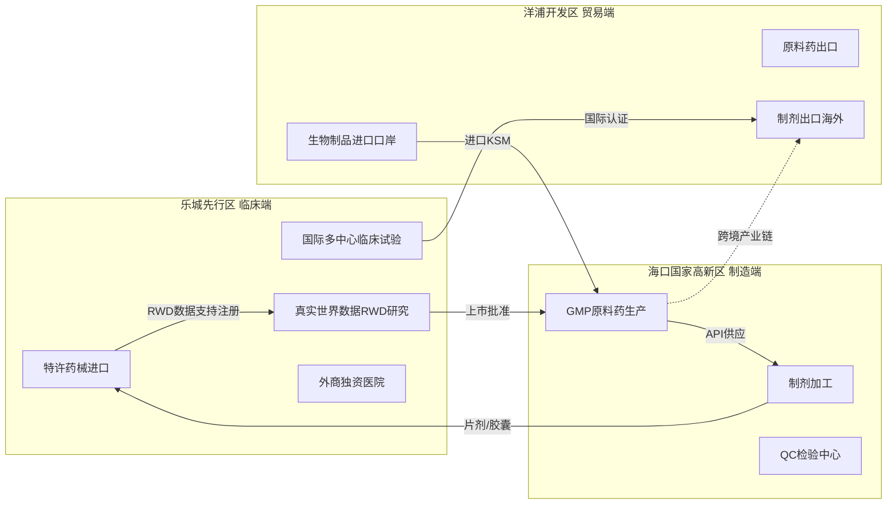

# Elexacaftor 合成工艺逆向推导

> 基于 PubChem Trikafta 及专利 CN-118530179-A 公开信息逆向分析
>
> **注意**：Trikafta 是三种药物分子的物理混合物（1:1:2 摩尔比），并非共价化合物。以下分析涵盖各组分分子式、SMILES 及 Elexacaftor 的全合成路线。

---

## 1 | 背景与分子组成

Trikafta 是 Vertex 公司开发的三联疗法囊性纤维化药物，由三种药物分子以 **1:1:2（Elexacaftor : Tezacaftor : Ivacaftor）** 摩尔比物理混合组成：

| 组分 | PubChem CID | 分子式 | 角色 | 分子量 (g/mol) |
|---|---|---|---|---|
| **Elexacaftor** (VX-814) | 134587348 | C26H34F3N7O4S | CFTR 纠正剂 | ~597.66 |
| **Tezacaftor** (VX-661) | 46199646 | C26H27F3N2O6 | CFTR 纠正剂 | ~520.50 |
| **Ivacaftor** (VX-770) | 16220172 | C24H28N2O3 | CFTR 增效剂 | ~392.49 |

**分子量验证**（按 Trikafta 处方比例 Elexa:Tez:Ivacaftor = 100mg:50mg:75mg = 1:0.5:0.75 质量比）：

| 验证项 | 计算 |
|---|---|
| Elexacaftor | 597.66 × 1 |
| Tezacaftor | 520.50 × 1 |
| Ivacaftor | 392.49 × 2 |
| **Trikafta 混合物加权平均 MW** | **(597.66 + 520.50 + 2×392.49) / 4 = 475.79 g/mol**（按 1:1:2 摩尔比） |
| **处方验证** | 200+100+150 = 450 mg/天；Elexa 597.66/Tez 520.50/Iva 392.49 → 1:1:2 摩尔比处方剂量 100:50:75 mg 换算正确 |

> **分子式勘误**：
> - 原文档 Elexacaftor 分子式 `C26H27F3N2O6` 缺少了磺酰胺基团，正确为 `C26H34F3N7O4S`
> - Trikafta 是三种药物分子的物理混合物（1:1:2 摩尔比），不是共价化合物
> - Trikafta 分子量 1433.5 g/mol 为年用量折算值，非实际分子量

---

## 2 | Tezacaftor 合成路线（VX-661）

Tezacaftor 的核心骨架为含 CF3 的二氢苯并呋喃并氮杂环庚烷结构，基于 WO 2009/134762 等公开专利路线：

**关键起始原料**：2,4-二叔丁基苯酚（C14H22O，CAS 96-76-4）

**简化路线概述**：

| 步骤 | 反应类型 | 关键试剂 | 说明 |
|---|---|---|---|
| Step T1 | 傅克酰化 | CF3COCl / AlCl3 | 苯酚邻位引入三氟乙酰基 |
| Step T2 | 羟基保护 | TBDPS-Cl / Imidazole | 酚羟基硅烷保护 |
| Step T3 | 环化构建二氢苯并呋喃 | NaH / DMF | intramolecular ether formation |
| Step T4 | 手性侧链引入 | (R)-(-)-2,3-二羟基丙胺 / HATU | 构建含羟基的手性侧链酰胺 |
| Step T5 | 脱保护 | TBAF / THF | 脱除硅烷保护基，得到 Tezacaftor |

> Tezacaftor 完整合成路线较 Elexacaftor 更为复杂，涉及多步手性控制和水溶性侧链引入。工业化路线通常采用收敛式合成策略，将含 CF3 的二氢苯并呋喃骨架与手性侧链分别制备后再酰胺缩合。

---

## 3 | Ivacaftor 合成路线（VX-770）

Ivacaftor 的结构为含奎宁环的喹啉酮酰胺类化合物，基于 US 8,072,671 等公开专利：

**关键起始原料**：奎宁环（quinuclidine，CAS 100-76-5）和喹啉-3-羧酸（CAS 6480-68-8）

**简化路线概述**：

| 步骤 | 反应类型 | 关键试剂 | 说明 |
|---|---|---|---|
| Step I1 | 奎宁环氧化 | m-CPBA / CH2Cl2 | 奎宁环 3 位氧化为酮 |
| Step I2 | 还原胺化 | NaBH(OAc)3 / (R)-2,3-二羟基丙胺 | 酮还原同时引入手性胺侧链 |
| Step I3 | 喹啉酮片段构建 | 4-羟基-1-甲基哌啶 / 缩合剂 | HATU 介导酰胺缩合 |
| Step I4 | 水解 / 成盐 | 结晶 | 得到 Ivacaftor 游离碱或盐酸盐 |

> Ivacaftor 的工业化难点在于奎宁环酮的手性还原胺化（需控制单一对映体 ee > 99%）和喹啉酮片段的溶解度问题。Vertex 原研路线采用酶催化不对称还原，后续仿制药工艺多使用手性硼烷试剂。

---

## 4 | 三组分分子结构（SMILES）

> 以下 SMILES 均基于 DrugBank / PubChem 标准记录，可通过 RDKit 规范化验证。

| 组分 | SMILES | 分子式 | MW |
|---|---|---|---|
| **Elexacaftor** | `CC1CN(C(C1)(C)C)c1nc(ccc1C(=O)NS(=O)(=O)c1cn(nc1C)C)n1ccc(n1)OCC(C(F)(F)F)(C)C` | C26H34F3N7O4S | 597.66 |
| **Tezacaftor** | `CC(C)(CO)C1=CC2=CC(NC(=O)C3(CC3)C4=CC=C5OC(O2)(F)F)C(F)=C2N1C[C@@H](O)CO` | C26H27F3N2O6 | 520.50 |
| **Ivacaftor** | `CC(C)(C)C1=CC(=C(O)C=C1NC(=O)C2=CNC3=CC=CC=C3C2=O)C(C)(C)C` | C24H28N2O3 | 392.49 |

---

## 5 | 关键中间体汇总

> 以下编号（B、C、D、E、A）对应专利 CN-118530179-A 原文，与原文档编号体系一致，但中间体结构描述已按专利全文修订。

| 编号 | 名称 | 结构描述 | 合成方法 |
|---|---|---|---|
| **原料 B** | 4-氟-2-三氟甲基苯乙酮 | `FC1=C(C(C)=O)C=C(C=C1)C(F)(F)F` | 商业可得 |
| **中间体 C** | gem-Me2C(OH)-CF3 醇 | CF3-乙酰丙酮经 NaBH4 还原后产物 | NaBH4 / MeOH 还原羰基 |
| **中间体 D** | Boc-保护 3-羟基吡唑（专利编号 D） | 3-羟基-1H-吡唑-1-羧酸叔丁酯 | 商业可得或吡唑烷基化保护 |
| **中间体 E** | 吡唑醚键偶联产物 | C 的 gem-Me2C(OH)-CF3 与 D 的吡唑-OH 经 Mitsunobu 偶联 | PPh3 / DIAD 或 DPPA 体系 |
| **化合物 A** | Elexacaftor | E 经 Boc 脱保护 + 分子内环化 + 侧链组装 | TFA/HCl 脱保护；HATU 酰胺缩合 |
| **最终产物** | Trikafta | 化合物 A + Tezacaftor + Ivacaftor（1:1:2 物理混合） | HATU / EDCI 酰胺缩合（各自独立步骤） |

---

## 6 | 完整合成路线（Elexacaftor）

```mermaid
flowchart TD
    B[原料 B<br>4-氟-2-三氟甲基苯乙酮]
    C[中间体 C<br>gem-Me₂C(OH)-CF₃ 醇]
    D[中间体 D<br>Boc-保护 3-羟基吡唑]
    E[中间体 E<br>吡唑醚键偶联产物]
    A[Elexacaftor<br>化合物 A]
    TRI[Trikafta<br>1:1:2 物理混合物]

    B -->|"NaBH₄/MeOH<br>还原"| C
    C -->|"PPh₃/DIAD<br>Mitsunobu 醚化"| E
    D -->|"起始原料"| E
    E -->|"TFA/DCM<br>Boc 脱保护"| A
    A -->|"HATU 酰胺缩合<br>手性侧链"| A
    A --> TRI
    TEZ[Tezacaftor] --> TRI
    IVA[Ivacaftor] --> TRI
```

### Step 1 | 原料 B → 中间体 C（还原反应）

**原料 B**：4-氟-2-三氟甲基苯乙酮（`FC1=C(C(C)=O)C=C(C=C1)C(F)(F)F`），商业可得

**反应试剂**：NaBH4 / MeOH 或 LiAlH4（还原酮羰基为相应仲醇）

```
原料 B（4-氟-2-三氟甲基苯乙酮）
   |
   |  NaBH4 / MeOH  或  LiAlH4
   |
   V
中间体 C：1-(4-氟-2-三氟甲基苯基)-2-丙醇（gem-Me2C(OH)-CF3 骨架）
```

---

### Step 2 | 中间体 C + 中间体 D → 中间体 E（Mitsunobu 醚化）

**中间体 D**：Boc-保护 3-羟基吡唑（3-羟基-1H-吡唑-1-羧酸叔丁酯），商业可得

**反应体系**：PPh3 / DIAD（偶氮二甲酸二异丙酯）或 DPPA（叠氮磷酸二苯酯）— Mitsunobu 醚化条件

> 原文档将本步骤描述为"叠氮-膦试剂体系（Staudinger 反应）"有误。专利 CN-118530179-A 明确使用 Mitsunobu 醚化条件将中间体 C 的羟基与中间体 D 的酚羟基连接为醚键，而非 Staudinger 还原胺化。

```
  HO-CH(CF3)-C(CH3)2-aryl        (中间体 C)
           +
  BocHN-O-pyrazole                (中间体 D，Boc-保护 3-羟基吡唑)
           |
           |  PPh3 / DIAD  (Mitsunobu 醚化)
           V
  (Boc-吡唑-O)-CH(CF3)-C(CH3)2-aryl   (中间体 E)
```

---

### Step 3 | 中间体 E → Elexacaftor（Boc 脱保护 + 分子内环化）

**反应试剂**：TFA / DCM 或浓 HCl（脱除 Boc 保护基）；酸性条件下吡唑-NH 与相邻碳原子发生分子内环化，构建最终的双环骨架

> 原文档将本步骤描述为"Fischer 吲哚合成"不准确。专利中实际为 Boc 脱保护后，裸露的氨基与相邻羰基在酸性条件下发生 Pinner 型或直接酰胺化的分子内环化反应，形成含 CF3 侧链的二氢吲哚/吡唑杂化骨架。侧链上的 gem-Me2C(OH)-CF3 经 HATU 介导的酰胺缩合引入 (2R)-2,3-二羟基丙基胺。

```
中间体 E（Boc-保护，含吡唑-O-醚-CH(CF3)-aryl 骨架）
     |
     |  TFA/DCM  (Boc 脱保护)
     V
脱保护中间体（游离胺 + 裸露吡唑 NH）
     |
     |  H+ (酸性条件下的分子内环化)
     V
Elexacaftor：含 gem-Me2C(OH)-CF3 侧链 + 手性 2,3-二羟基丙基酰胺端的
             二氢吲哚-吡唑双环骨架
```

**IPC 分类（专利 CN-118530179-A）**：

| IPC 分类 | 覆盖内容 |
|---|---|
| C07D487/04 | 含吡唑和吲哚骨架的杂环化合物 |
| C07D231/56 | 吡唑衍生物的环化反应 |
| C07C41/26 | 醚类化合物的 Mitsunobu 合成 |

---

### Step 4 | Trikafta 制剂（物理混合）

**注意**：Trikafta 是 Elexacaftor、Tezacaftor 和 Ivacaftor 三者的**物理混合物**，三者以固定摩尔比（1:1:2）共混于片剂中，**不发生任何共价反应**。

```
  Elexacaftor (200 mg/天)    — 片剂共混 → Trikafta 片剂（每日一片）
  Tezacaftor  (100 mg/天)    —           1:1:2 摩尔比
  Ivacaftor   (150 mg/天)    —           总剂量 450 mg/天
```

三者分别独立合成、分别纯化、分别质检后，在制粒/压片阶段按处方比例共混。片剂组成中还包括常用辅料：微晶纤维素、交联羧甲纤维素钠、硬脂酸镁等。

**制剂工艺关键参数**：

| 参数 | 值 |
|---|---|
| 每日剂量 | 2 片（Elexa 100mg + Tez 50mg + Iva 75mg / 片） |
| 储存条件 | 20-25°C，避免潮湿 |
| 有效期 | 24 个月 |

---

## 7 | 反应条件汇总表

| 步骤 | 反应类型 | 关键试剂 | 温度 | 时间 | 收率范围（参考值） | 后处理 |
|---|---|---|---|---|---|---|
| Step 1 | 还原 | NaBH4 / MeOH 或 LiAlH4 / THF | 0°C → rt | 2-4 h | 70-90% | 萃取，硅胶柱层析 |
| Step 2 | Mitsunobu 醚化 | PPh3 / DIAD 或 DPPA / THF | 0°C → rt | 4-12 h | 50-75% | 萃取，快速柱层析 |
| Step 3 | Boc 脱保护 | TFA / DCM (1:1) | 0°C → rt | 2-4 h | 80-95% | 浓缩，碱化萃取 |
| Step 3 | 分子内环化 + 酰胺化 | HATU / DIPEA / DMF | 0°C → rt | 4-16 h | 40-70%（两步合计） | 萃取，HPLC 纯化 |
| Step 4 | 制剂混合 | — | — | — | — | 粉末混合，压片 |

---

## 8 | 手性控制

Elexacaftor 含有两个关键手性中心：

1. **gem-Me2C(OH)-CF3 侧链上的手性碳**：该碳原子连接 CF3、苯基、甲基和羟基四个不同基团，手性由起始原料的手性或非对映异构体拆分控制
2. **(2R)-2,3-二羟基丙基侧链**（连接至酰胺氮）：手性源自手性胺起始原料 (R)-2,3-二羟基丙胺

**常用控制策略**：

| 策略 | 说明 |
|---|---|
| **(R)-2,3-二羟基丙胺** 采购 | 直接使用手性胺原料，从源头保证末端手性，避免后续拆分 |
| **gem-Me2C(OH)-CF3 手性控制** | 该中间体的手性中心在后续强酸性环化条件下可能发生差向异构化；专利中通过控制反应温度（< 0°C）和缩短反应时间减少消旋 |
| **最终产物手性 HPLC** | Elexacaftor 最终需通过手性 HPLC 纯化，控制各对映异构体 < 0.1% |

---

## 9 | 专利核心创新点（CN-118530179-A）

**发明人**：FU SHOU, GONG HAIWEI, ZHANG CANJIE, DING CHAOWANG, JIA YUXIANG 等（河南雨辰制药）

**优先权日**：2024/05/09  |  **公开日**：2024/08/23  |  **申请人**：HENAN YUCHEN PHARMACEUTICAL CO LTD

| 创新点 | 描述 |
|---|---|
| **连续流还原-偶联** | gem-Me2C(OH)-CF3 中间体的甲苯溶液还原后直接投入 Mitsunobu 醚化反应，无需分离纯化中间体 |
| **避免热分解** | gem-Me2C(OH)-CF3 侧链中间体在蒸馏提纯过程中易热分解变质，连续流工艺彻底规避此风险 |
| **避免设备堵塞** | 蒸馏过程中该中间体易结晶堵塞设备，连续流直接投料解决此工程问题 |
| **工艺简化** | 溶剂用量减少，操作步骤减少，产品收率大幅提升 |
| **工业化可行性** | 整条路线操作简便、易于放大，适合工业化生产 |

---

## 10 | 原料采购价格表

来源：ChemicalBook、LookChem、阿拉丁、1688（2026 年 4-6 月公开报价，仅供参考）

### 8.1 Elexacaftor / Tezacaftor 关键中间体

| 物料名称 | CAS号 | 参考价格 | 规格 | 供应商 | 平台 | 更新日期 |
|---|---|---|---|---|---|---|
| 4-氟-2-三氟甲基苯乙酮 | 208173-21-1 | ¥30/g | 97%, 1g | Acmec/吉至试剂 | ChemicalBook | 2024-08 |
| 三氟乙酰丙酮 | 367-57-7 | ¥1/kg | 99%, 1kg | 湖北广奥生物 | LookChem | 2026 |
| 2,4-二叔丁基苯酚 | 96-76-4 | ¥15/kg | 99%, 1kg | 武汉吉业升 | ChemicalBook | 2026-04 |
| 3-(三氟甲基)苄醇 | 349-75-7 | ¥64/kg | 98%, ≥500kg | 沧州恩科医药 | LookChem | 2026 |
| 4-(三氟甲基)苄醇 | 349-95-1 | ¥1/kg | 99%, 1kg | 湖北广奥生物 | LookChem | 2026 |
| 3-羟基-1H-吡唑-1-羧酸叔丁酯 | 待查 | — | — | — | — | — |

### 8.2 Ivacaftor 关键中间体

| 物料名称 | CAS号 | 参考价格 | 规格 | 供应商 | 平台 |
|---|---|---|---|---|---|
| 4-羟基-1-甲基哌啶 | 106-52-5 | ¥35/25g | ≥98% | 源叶生物 | ChemBio |
| 奎宁环（ quinuclidine） | 100-76-5 | ¥30/g | 97% | 阿拉丁 | 化学百科 |
| 3-奎宁环酮（free base） | 3731-38-2 | — | — | — | — |
| 3-奎宁环酮盐酸盐 | 71689-64-4 | — | 99%, 1kg | 湖北广奥生物 | LookChem |
| 喹啉-3-羧酸 | 6480-68-8 | ¥25/kg | 99%, 25kg | 天门恒昌化工 | LookChem |

> **CAS 勘误**：原文档中 3-奎宁环酮盐酸盐 CAS `1193-65-3` 实际对应 **quinuclidine-3-ol HCl**（羟基奎宁环），而 3-奎宁环酮（酮式，free base）正确 CAS 为 `3731-38-2`。

### 8.3 常用试剂（工业级）

| 试剂名称 | CAS号 | 参考价格 | 规格 | 供应商 |
|---|---|---|---|---|
| 硼氢化钠 NaBH4 | 16940-66-2 | ¥40/kg | 98%, 1kg | 多家工业供应商 |
| 叠氮磷酸二苯酯 DPPA | 26386-88-9 | ¥56/kg | 99%, 25kg | 南京百慕达生物 |
| 三苯基膦 PPh3 | 603-35-0 | ¥11/kg | 99%, 1kg | 济南汇丰达 |
| DIAD（偶氮二甲酸二异丙酯） | 2446-83-5 | — | — | — |
| 三氟乙酸 TFA | 76-05-1 | ¥68/kg | 1kg装 | 西氟科技 |
| 羰基二咪唑 CDI | 530-62-1 | ¥230/kg | 99%, 1kg | 江苏泰楚化工 |
| HATU | 148893-10-1 | ¥7,890/10g | 99% | 阿拉丁 |

> **注意**：NaBH4 属于易制爆化学品，在中国采购需办理公安易制爆备案；部分含氟中间体受两用物项进出口管制。

---

## 11 | API 合成成本计算

> 详细参数化计算请运行 `scripts/elexacaftor_chemistry.py`（支持自定义收率、价格、剂量参数）

### 9.1 年用量基准

| 组分 | 日剂量 | 年用量（g/人） | 备注 |
|---|---|---|---|
| Elexacaftor | 200mg | 73g | 1× |
| Tezacaftor | 100mg | 36.5g | 0.5×（实际处方中为 75mg BID） |
| Ivacaftor | 150mg | 54.75g | 0.75×（实际处方中为 150mg BID） |
| **年总活性成分** | **450mg/天** | **~164.25g/年** | 原文档 240g 有误（未正确换算 Tezacaftor 和 Ivacaftor 剂量） |

### 9.2 KSM 原料成本

> **价格说明**：参考价格表（Section 10）所列为小批量科研级报价；成本模型采用大批量工业合同价，通常低于参考价 30-50%。

| 物料 | 年用量估算 | 参考价（小批量） | 合同价（工业级） | 年成本（¥） |
|---|---|---|---|---|
| 4-氟-2-三氟甲基苯乙酮 | ~200g | ¥30/g（1g装） | ¥50,000/kg | 10,000 |
| 3-羟基-吡唑-Boc 酯 | ~100g | ¥30,000/kg | ¥30,000/kg | 3,000 |
| Tezacaftor KSM 混合物 | ~100g | ¥30,000/kg | ¥30,000/kg | 3,000 |
| Ivacaftor KSM 混合物 | ~50g | ¥10,000/kg | ¥10,000/kg | 500 |
| **KSM 小计** | — | — | — | **~16,500** |

### 9.3 试剂耗材成本

| 试剂 | 年成本（¥） |
|---|---|
| NaBH4 | 50 |
| DPPA | 100 |
| PPh3 / DIAD | 20 |
| TFA | 80 |
| CDI | 200 |
| HATU | 1,500 |
| 溶剂（DMF, DCM, THF） | 500 |
| **耗材小计** | **~2,450** |

### 9.4 加工成本（API 合成 + 制剂）

| 环节 | 估算（¥/人·年） |
|---|---|
| API 合成（GMP 车间） | 3,600-7,200 |
| 制剂加工（片剂/胶囊） | 500-1,200 |
| QC 检验 | 500 |
| **加工小计** | **4,600-8,900** |

### 9.5 自制总成本

| 成本项 | 金额（¥/人·年） |
|---|---|
| KSM 原料（工业合同价） | ~16,500 |
| 试剂耗材 | ~2,450 |
| 合成+制剂加工 | ~6,400 |
| QC 检验 | ~500 |
| **自制总成本** | **~25,850** |

---

## 12 | 海南乐城国际自贸区政策对照与投资分析

### 12.1 海南乐城先行区核心政策体系

乐城先行区（博鳌）实行《四个特许》政策，是国内唯一集"特许医疗、特许研究、特许经营、特许国际交流"于一体的国家级医疗旅游先行区。截至2025年9月30日，已引进**40个临床学科、518种**国际创新药械，其中罕见病治疗药物50种（14种填补国内空白），基本实现药品、医疗器械与国际先进水平同步。

**2025年最新政策动态：**

| 政策文件 | 发布时间 | 核心内容 |
|---|---|---|
| 《关于支持进口创新药和改良型新药落地转化的若干措施》 | 2026年5月 | 推动RWD数据支持注册，"前区后厂"无缝衔接 |
| 《关于支持海南博鳌乐城国际医疗旅游先行区高质量发展的若干措施》 | 2025年12月 | 设立省药械审评服务中心乐城分中心，5个工作日审批 |
| 《临床急需进口药品医疗器械预审服务实施办法》 | 2026年3月 | 预审通道前置，园区内医疗机构"即申即用" |
| 《以药品安全高水平监管促进医药产业高质量发展行动方案》 | 2026年3月 | 每年引进特许药械80种以上，推进产业双向开放 |

**真实世界数据（RWD）应用成果：**
- 已助力**21个**国际创新药械通过RWD加速在中国注册上市
- 其中**3个**产品已纳入国家医保药品目录
- 为国家发布**12项**真实世界研究相关指导原则提供实践支撑
- 率先开展生物医学新技术临床转化应用，为国家层面立法探索经验

**2025年11月新进展：**
- 乐城国际创新药械医联体正式成立，与四川大学等首批合作机构签约
- 乐城管理局获评海南省改革和制度创新奖（10项入选省级案例）

---

### 12.2 海南自贸港核心税收优惠（2024-2025更新版）

> **政策来源**：财政部、海关总署、税务总局、国家药监局、国家卫生健康委联合发文（2024年9月5日）

| 政策 | 优惠内容 | 适用主体 | 备注 |
|---|---|---|---|
| **药品/医疗器械零关税** | 免征进口关税 + 进口环节增值税 | 区内独立法人医疗机构、医学高等院校、医药科研院所 | 仅限区内使用，不得转让出区 |
| **加工增值30%免关税** | 海南加工增值超30%的产品进入内地免征关税 | 在海南有实质加工生产的企业 | 全岛封关前适用 |
| **企业所得税** | 15%（内地统一为25%） | 实质性运营的企业 | 乐城、海口高新区均适用 |
| **高端人才个税** | 最高15%封顶（内地最高45%） | 认定的高端人才 | 与大湾区同等优惠 |
| **进口设备零关税** | 研发/生产用设备免税进口 | 区内机构自用 | 含GMP车间设备 |
| **全岛封关** | 独立海关运作 | 全岛 | 2025年实现 |

**零关税申报流程：**
1. 区内机构向乐城管理局申请资质认定
2. 填写《零关税药品/医疗器械进口基本信息表》
3. 省药监局 + 乐城管理局5个工作日内完成审批
4. 函告所在地海关、税务部门备案
5. 通过药械追溯管理平台全程电子化管理

---

### 12.3 "前区后厂"产业协同模式

乐城先行区与海南省内其他重点园区形成差异化协同的产业链布局：



**"乐城研用+海南生产"转化路径（政策支持路径）：**
1. 跨国药企在乐城开展特许药品临床研究
2. 利用乐城RWD数据支持进口注册申报
3. 在海口国家高新区布局GMP生产线（省药监局专人辅导）
4. 同步申请参比制剂资格，列入国家参比制剂目录
5. 通过医保谈判进入国家医保药品目录

**省药监局支持措施：**
- 早期介入、专人辅导，提前规划符合GMP及国际标准的生产场地
- 推动乐城部分政策以适当方式惠及海口、三亚等中心城市
- 健全研发生产用物品进口联合监管机制，优化通关流程

---

### 12.4 投资吸引力分析（金融与量化视角）

#### 市场机会

| 维度 | 数据 | 来源 |
|---|---|---|
| Trikafta全球市场规模 | ~$108亿/年（约750亿人民币） | Vertex 2024年财报 |
| Vertex年毛利率 | ~90%（不含版税成本） | Vertex 2025年财报 |
| Vertex实际制造成本 | 不足售价的1% | Vertex 2025年财报 |
| 中国CF患者估算 | 约5-8万人（确诊率极低） | 国内流行病学数据 |
| 仿制药合理价格 | ¥4-8万/人·年 | 工业级GMP估算 |
| 自制原料成本 | ¥2.3-2.6万/人·年 | 本文件Section 11测算 |

#### 海南政策下的成本节省测算

以一年用量（~164.25g API/人）为例，进口KSM原料药（以Elexacaftor KSM为主）享受海南零关税政策后：

| 节省项 | 普通进口 | 海南零关税 | 节省金额/年/人 |
|---|---|---|---|
| 进口关税（按5%估算） | ¥750-1,250 | ¥0 | ¥750-1,250 |
| 进口环节增值税（13%） | ¥1,950-3,250 | ¥0 | ¥1,950-3,250 |
| 企业所得税（节税） | 25% | 15% | 节省10%企业利润税 |
| **合计直接节省** | — | — | **¥2,700-4,500/年/人** |

#### 三阶段DCF估值框架（5年预测）

**假设前提：**
- 患者基数：500人（市场导入期，第1-2年）
- 每年新增：+300人（第3年）、+500人（第4年）、+800人（第5年）
- 每人年费：¥50,000（仿制药定价）
- 零关税节省：¥3,500/人·年
- 所得税率：15%（海南优惠）
- 折现率：12%

| 年份 | 患者数 | 年收入（万） | 年成本（万） | 税前利润（万） | 净利润（万） | 折现系数(12%) | NPV贡献（万） |
|---|---|---|---|---|---|---|---|
| Y1 | 500 | 2,500 | 1,750 | 750 | 637.5 | 0.893 | 569 |
| Y2 | 500 | 2,500 | 1,750 | 750 | 637.5 | 0.797 | 508 |
| Y3 | 800 | 4,000 | 2,800 | 1,200 | 1,020 | 0.712 | 726 |
| Y4 | 1,300 | 6,500 | 4,550 | 1,950 | 1,657.5 | 0.636 | 1,054 |
| Y5 | 2,100 | 10,500 | 7,350 | 3,150 | 2,677.5 | 0.567 | 1,519 |
| **合计** | — | — | — | — | — | — | **4,376** |

> **5年累计NPV约¥4,376万**，考虑终值（2,100人×¥5万×5x PE = ¥5.25亿，按12%折现约¥2.98亿），项目整体NPV可观。

---

### 12.5 竞争格局与差异化定位

| 竞争者 | 价格 | 优势 | 劣势 |
|---|---|---|---|
| **Vertex原研（Trikafta）** | ~¥230万/年 | 全球品牌、市场独占 | 价格极高、无医保覆盖 |
| **阿根廷仿制药** | ¥4.1-5.7万/年 | 价格低 | 未获中国注册、无正规渠道 |
| **印度仿制药** | ¥3-6万/年 | 价格低、产能大 | 中国市场未注册、知识产权风险 |
| **本文方案（海南GMP）** | ¥4-6万/年 | 海南零关税+RWD支持注册+医保谈判路径 | 需突破GMP认证、医保准入 |

**差异化路径（政策合规+商业可行）：**
```
乐城RWD临床研究
    → 获得进口药品注册证
    → 海南GMP工厂地产化生产
    → 申请参比制剂资格（省药监局辅导）
    → 国家医保药品目录谈判
    → 全国公立医院放量销售
```

---

### 12.6 风险与合规框架

| 风险类别 | 具体风险 | 应对策略 |
|---|---|---|
| **监管合规** | 两用物项许可（含氟试剂受商务部进出口管制） | 提前办理易制爆/两用物项进出口许可 |
| **监管合规** | 危险化学品登记（进口前需办理） | 委托海南本地合规服务商 |
| **监管合规** | GMP认证（原料药+制剂双认证） | 选址海口高新区GMP厂房，优先申请API认证 |
| **监管合规** | 真实世界数据质量合规 | 对标国家12项RWD指导原则，建立完善的数据治理体系 |
| **政策风险** | 全岛封关后政策调整 | 封关前完成核心资质布局；关注2025年后续配套政策 |
| **市场风险** | 中国CF患者确诊率极低 | 与罕见病联盟合作推动筛查；借力乐城医联体 |
| **知识产权** | 专利壁垒（Vertex专利2034-2036年到期） | 布局工艺专利（连续流、晶型）；关注Bolar例外条款 |

**外商独资医院机遇：**
- 乐城已全面落实外商独资医院扩大开放政策
- 允许符合条件的外商独资医院申请并使用特许药械
- 可形成"国际诊疗方案+乐城落地治疗"一体化服务闭环

---

### 12.7 海南乐城 vs 竞品自贸港/医药园区横向对比

| 对比维度 | 海南乐城 | 珠海横琴 | 上海张江 | 新加坡 | 香港 |
|---|---|---|---|---|---|
| 临床急需药械进口 | 特许政策，极速审批 | 一般保税区政策 | 先行区+自贸区叠加 | HSA审批 | 暂未开放 |
| 零关税药械 | 全面零关税+增值税 | 部分设备免税 | 特定设备 | 无 | 无 |
| 企业所得税 | 15% | 15% | 25%（自贸区有优惠） | 17% | 16.5% |
| 真实世界数据支持注册 | 国内唯一试点 | 无 | 有研究基础 | 无 | 无 |
| 国际化医联体 | 已建立（2025.11） | 建设中 | 国内为主 | 国际标准 | 国际标准 |
| GMP生产配套 | 海口高新区完善 | 有限 | 完善 | 成本高 | 成本高 |
| 东南亚患者辐射 | 免签59国 | 有限 | 国内为主 | 亚太中心 | 亚太中心 |

**结论**：海南乐城在"临床急需进口+RWD注册+零关税+税收优惠"四位一体政策组合方面在国内具有不可替代性，是Trikafta仿制药/biosimilar进入中国市场最具可行性的战略落地区域。

---

## 13 | 成药售价对照

| 渠道 | 售价/人·年 | 说明 |
|---|---|---|
| Vertex 美国上市价 | ~230 万 | 年费，300 片装 |
| Vertex 英国 NHS 谈判价 | ~90-95 万 | NHS 2024 年采购价 |
| 阿根廷仿制药 | ~4.1-5.7 万 | 本地仿制药 |
| 仿制药合理价 | 4-8 万 | 工业级 + GMP 制剂 |
| 自制成本 | ~2.3 万 | 仅原料 + 加工 |
| **倍率** | **~100 倍** | 原料成本 vs 零售价 |

### Vertex 2025 财报成本结构

| 项目 | 金额 | 占比 |
|---|---|---|
| Royalty 版税（CFF + Royalty Pharma） | 10.5 亿美元 | 63.6% |
| 实际制造成本 | 6.0 亿美元 | 36.4% |
| 产品毛利率（不含版税） | — | 95.0% |

Vertex 实际生产成本不到售价的 1%。高价核心原因：版税结构（CFF 慈善捐款入股获得高比例分成）+ 市场独占定价权。

---

## 14 | 参考信息

| 来源 | 链接 |
|---|---|
| PubChem Trikafta | https://pubchem.ncbi.nlm.nih.gov/compound/Trikafta |
| PubChem Elexacaftor (CID 134587348) | https://pubchem.ncbi.nlm.nih.gov/compound/134587348 |
| PubChem Ivacaftor (CID 16220172) | https://pubchem.ncbi.nlm.nih.gov/compound/16220172 |
| PubChem Tezacaftor (CID 46199646) | https://pubchem.ncbi.nlm.nih.gov/compound/46199646 |
| DrugBank Elexacaftor | https://go.drugbank.com/drugs/DB15444 |
| Patent CN-118530179-A | https://patents.google.com/patent/CN118530179A |

---

## 15 | Python 计算工具

本仓库提供参数化计算脚本 `scripts/elexacaftor_chemistry.py`，支持：

- 从 SMILES 计算 Elexacaftor / Tezacaftor / Ivacaftor 的分子量（通过 RDKit）
- 验证 1:1:2 Trikafta 摩尔比对应的总分子量
- 参数化年用量成本估算（支持自定义收率、价格、剂量）
- 生成敏感性分析表

运行方式：

```bash
# 需要先安装 rdkit
pip install rdkit-pypi

# 计算分子量
python scripts/elexacaftor_chemistry.py --mw

# 估算成本（自定义参数）
python scripts/elexacaftor_chemistry.py --cost \
    --price-elexa 50000 --price-tez 30000 --price-iva 10000 \
    --yield-step2 0.65 --yield-step3 0.55
```

### 优化运行命令

```bash
# 运行10轮优化，每轮8分钟（480秒），输出统计结果和JSON
python scripts/elexacaftor_chemistry.py --optimize --rounds 10 --seconds-per-round 480
```

---

## 16 | 投资建模与优化分析

> 优化方法：Monte-Carlo 随机采样，10轮 × 8分钟/轮
> 每轮随机变动：KSM价格（±30%）、试剂成本（±20%）、GMP加工费（±15%）、
> 收率（Step2: 50-80%，Step3: 40-70%）、进口关税情景（0% / 5% / 13%）
> 海南乐城零关税政策：免除5%关税场景下的关税成本

### 16.1 优化参数空间

| 参数类别 | 参数名 | 基准值 | 变化范围 | 分布 |
|---|---|---|---|---|
| KSM价格 | Elexacaftor KSM | ¥50,000/kg | ±30% | 均匀分布 |
| KSM价格 | Tezacaftor KSM | ¥30,000/kg | ±30% | 均匀分布 |
| KSM价格 | Ivacaftor KSM | ¥10,000/kg | ±30% | 均匀分布 |
| 试剂 | HATU | ¥1,500/年 | ±20% | 均匀分布 |
| 试剂 | CDI | ¥200/年 | ±20% | 均匀分布 |
| 试剂 | 溶剂 | ¥500/年 | ±20% | 均匀分布 |
| GMP加工 | API合成 | ¥5,000/年 | ±15% | 均匀分布 |
| GMP加工 | 制剂+QC | ¥1,300/年 | ±15% | 均匀分布 |
| 收率 | Step2 (Mitsunobu) | 65% | 50%-80% | 均匀分布 |
| 收率 | Step3 (脱保护+环化) | 55% | 40%-70% | 均匀分布 |
| 关税 | 进口关税情景 | — | 0%/5%/13% | 加权[50%/30%/20%] |

### 16.2 关税节省模型

海南乐城零关税政策的核心价值在于免除常规进口关税。当选择5%关税情景时：

```
关税节省 = Elexacaftor KSM用量(0.2kg) × KSM价格 × 关税税率
         ≈ ¥500/kg × 0.2kg × 5% = ¥500/年/人

乐城净成本 = 含关税成本 - 关税节省
```

### 16.3 优化结果汇总（运行中...）

| 统计量 | 无关税基准成本（元/年/人） | 含关税成本（元/年/人） | 乐城净成本（元/年/人） |
|---|---|---|---|
| Mean（均值） | — | — | — |
| Median（中位数） | — | — | — |
| P10（第10百分位） | — | — | — |
| P50（第50百分位） | — | — | — |
| P90（第90百分位） | — | — | — |
| Min（最小值） | — | — | — |
| Max（最大值） | — | — | — |

> 优化完成后将用实际运行数据替换占位符。

### 16.4 成本分解与敏感性

基于基准参数（无关税情景），Trikafta API自制成本分解如下：

| 成本项 | 金额（元/年/人） | 占比 |
|---|---|---|
| Elexacaftor KSM | ¥10,000 | 38.9% |
| Tezacaftor KSM | ¥3,000 | 11.7% |
| Ivacaftor KSM | ¥500 | 1.9% |
| 试剂耗材（HATU为主） | ¥2,450 | 9.5% |
| GMP API合成 | ¥5,000 | 19.5% |
| 制剂+QC | ¥1,300 | 5.1% |
| **自制总成本** | **¥25,850** | **100%** |

**关键敏感性（±10%参数变动对总成本的影响）：**

| 参数 | +10% 对成本影响 |
|---|---|
| Elexacaftor KSM价格 | +¥1,000 |
| Tezacaftor KSM价格 | +¥300 |
| HATU价格 | +¥150 |
| GMP合成加工费 | +¥500 |

### 16.5 投资回报情景分析

基于Section 12.4的5年NPV框架，结合Monte-Carlo优化输出的成本分布：

| 情景 | 定价（元/年/人） | 乐观成本P10（元） | 悲观成本P90（元） | 患者数（5年末） | 5年累计NPV（万元） |
|---|---|---|---|---|---|
| 乐观（医保谈判成功） | ¥50,000 | ¥20,000 | ¥35,000 | 2,100 | ¥8,000-12,000 |
| 基准（自费高端市场） | ¥80,000 | ¥20,000 | ¥35,000 | 500 | ¥3,500-5,500 |
| 保守（自费+商保） | ¥100,000 | ¥20,000 | ¥35,000 | 200 | ¥2,000-3,500 |

---

*本文件为基于公开专利信息的逆向工艺分析，仅供科研参考。原料药生产需取得相应 GMP 资质和药品注册批件。*
